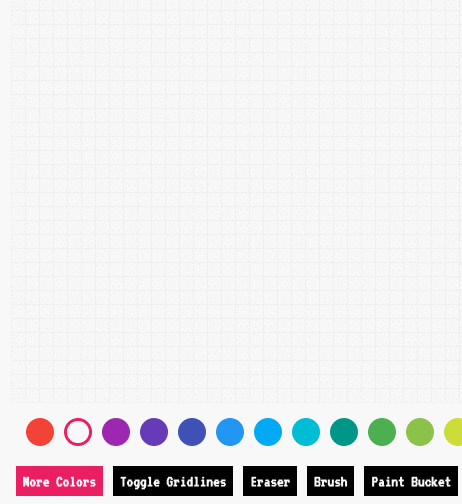

<h1>Pixl</h1>

<a href="https://pixl-app.herokuapp.com/#/">See it live</a>

Pixl is a web application for creating and sharing pixel art. It is built with Ruby on Rails, React-Redux, PostgreSQL and HTML Canvas.

<h2>Features and Implementation</h2>

<h3>Drawing</h3>

To create a new post users are able to color in cells by clicking or dragging.



The drawing surface is made by rendering 2500 square `<li>` elements using React. The background color of each square is stored as one-dimensional array in the `Canvas` component's local state.

Every square has two event listeners. One is an `onClick` event which triggers the `handleClick` callback, coloring in a single square. The second is `onMouseOver` which which triggers the `handleDrag` callback, and paints squares on mouseover, but only if the event's `buttons` property is equal to `1`, indicating that the left mouse button is pressed.

To implement the paint bucket tool I used a recursive algorithm, which looks at the squares immediately above and below the square that was clicked on. If any of the adjacent squares matches the color of the clicked square, the function will paint that square and then call itself recursively. This is what it looks like:

```javascript

paintBucket(idx, pixels) {
  idx = parseInt(idx);

  function paint(idx, pixels, brushColor) {
    const oldColor = pixels[idx];
    pixels[idx] = brushColor;

    if (pixels[idx + 1] === oldColor && (idx + 1) % 50 !== 0) {
      pixels = paint(idx + 1, pixels, brushColor);
    }
    if (pixels[idx - 1] === oldColor && idx % 50 !== 0) {
      pixels = paint(idx - 1, pixels, brushColor);
    }
    if (pixels[idx - 50] === oldColor) { //look at the adjacent square to the top
      pixels = paint(idx - 50, pixels, brushColor);
    }
    if (pixels[idx + 50] === oldColor) { //loot at the adjacent square to the bottom
      pixels = paint(idx + 50, pixels, brushColor);
    }
    return pixels;
  }

  paint(idx, pixels, this.state.brushColor)
  this.setState({pixels});
}

```

The `idx` parameter is the index of the clicked square and `pixels` parameter is the duplicated array of colors, taken from the state.


