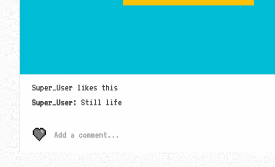

<h1>Pixl</h1>

<a href="https://pixl-app.herokuapp.com/#/">See it live</a>

Pixl is a web application for creating and sharing pixel art. It is built with Ruby on Rails, React-Redux, PostgreSQL and HTML Canvas.

<h2>Features and Implementation</h2>

<h3>Drawing</h3>

To create a new post users are able to color in cells by clicking or dragging.


The drawing surface is made by rendering 2500 square `<li>` elements using React. The background color of each square is stored as one-dimensional array in the `Canvas` component's local state.

Every square has two event listeners. One is an `onClick` event which triggers the `handleClick` callback, coloring in a single square. The second is `onMouseOver` which which triggers the `handleDrag` callback, and paints squares on mouseover, but only if the event's `buttons` property is equal to `1`, indicating that the left mouse button is pressed.

To implement the paint bucket tool I used a recursive algorithm, which looks at the squares immediately above and below the square that was clicked on. If any of the adjacent squares matches the color of the clicked square, the function will paint that square and then call itself recursively. This is what it looks like:

```javascript
//The 'idx' parameter is the index of the clicked square and 'pixels'
//parameter is the duplicated array of colors, taken from the state.
paintBucket(idx, pixels) {
  idx = parseInt(idx);

  function paint(idx, pixels, brushColor) {
    const oldColor = pixels[idx];
    pixels[idx] = brushColor;

    if (pixels[idx + 1] === oldColor && (idx + 1) % 50 !== 0) {
      pixels = paint(idx + 1, pixels, brushColor);
    }
    if (pixels[idx - 1] === oldColor && idx % 50 !== 0) {
      pixels = paint(idx - 1, pixels, brushColor);
    }
    if (pixels[idx - 50] === oldColor) { //look at the adjacent square to the top
      pixels = paint(idx - 50, pixels, brushColor);
    }
    if (pixels[idx + 50] === oldColor) { //loot at the adjacent square to the bottom
      pixels = paint(idx + 50, pixels, brushColor);
    }
    return pixels;
  }

  paint(idx, pixels, this.state.brushColor)
  this.setState({pixels});
}

```

On the back end the drawings are stored in a column in the `posts` table as an array.

<h3>Feed</h3>

The index page is a feed which displays the most recent posts by the current user as well as posts by users they follow. To fetch the feed I used a custom ActiveRecord query that looks like this:

```ruby
def feed
  Post.joins(:author)
    .joins("LEFT OUTER JOIN follows ON followee_id = users.id")
    .where("follows.follower_id = :id OR posts.user_id = :id", id: self.id)
    .order("posts.id DESC").select("DISTINCT ON (posts.id) posts.*")
end
```

To display the drawings in the feed, I used the following function to render the drawings to an HTML Canvas:

```javascript
updateCanvas(drawing) {

  const ctx = this.refs.canvas.getContext('2d');
  let x, y;

  for (let i = 0; i < drawing.length; i++) {
    x = (i % 50) * 14;
    y = Math.floor(i / 50) * 14;
    ctx.fillStyle = drawing[i];
    ctx.fillRect(x, y, 14, 14)
  }

}
```

<h3>Likes and Comments</h3>




<h2>Future Features</h2>

<h3>Undo/redo<h3>

Using Redux, the store will hold past, present and future states representing the drawing changes made to the drawing. Undoing will push the present state to the top of the future state stack and will take the last state from the top of the past state and make it the present state. Redoing will perform the action in reverse. The undo/redo state will look similar to this example from the Redux docs:

```javascript
{
  counter: {
    past: [ 0, 1, 2, 3, 4, 5, 6, 7, 8, 9 ],
    present: 10,
    future: []
  }
}
```

<h3>Hashtags</h3>

Users will be able to tag posts, either in the initial caption or in the comments, using hashtags. This would allow users to search and display recent posts with certain hashtags.

<h3>Square Tool</h3>

Users can drag to create perfect rectangles.
